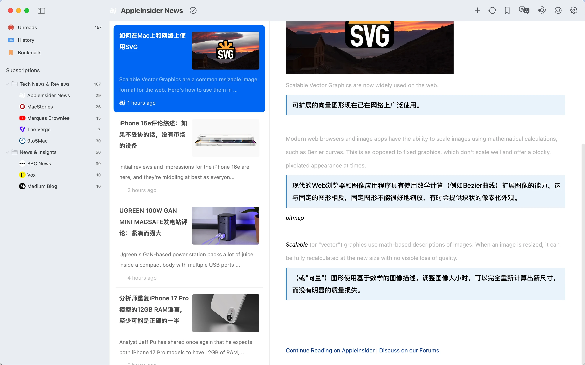
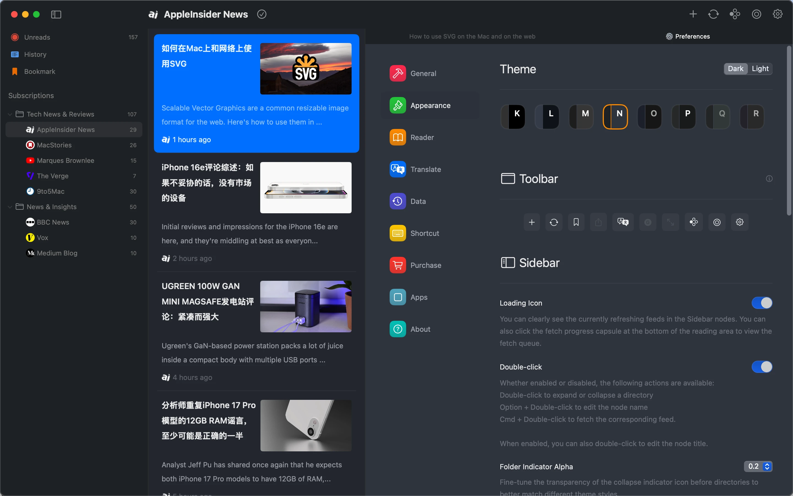
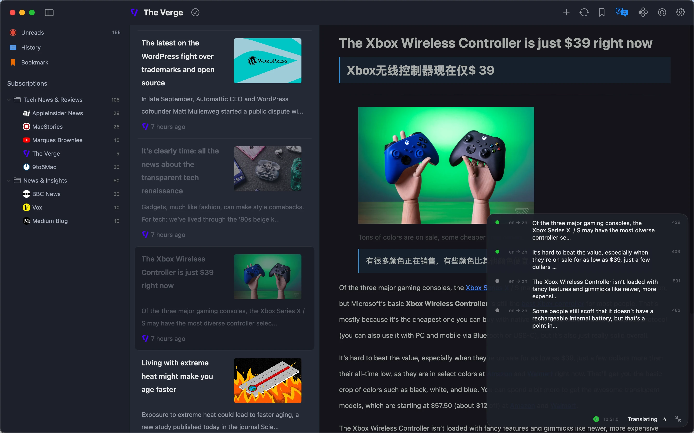
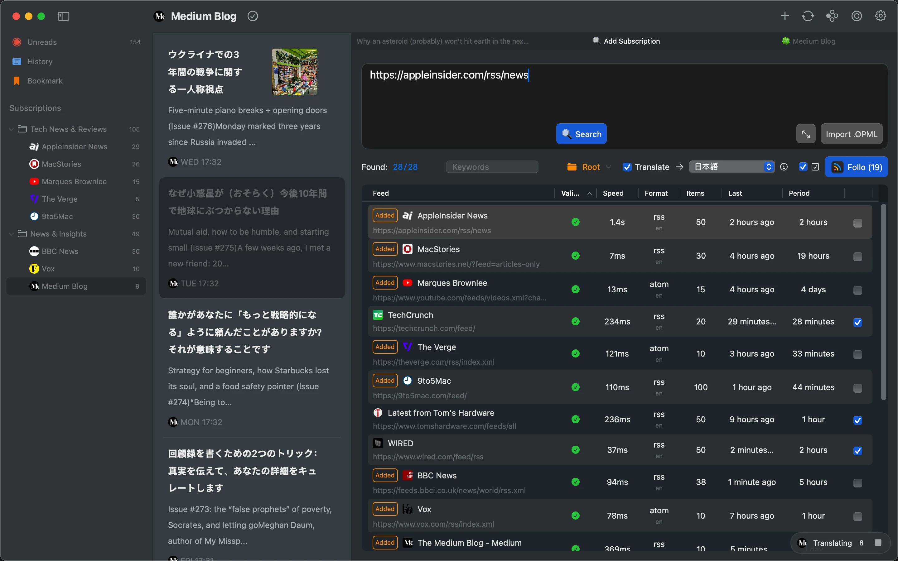
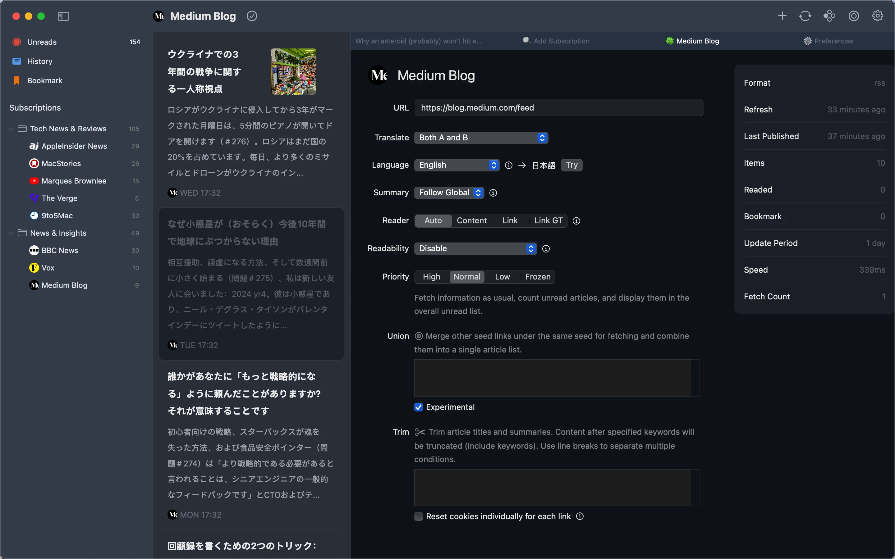
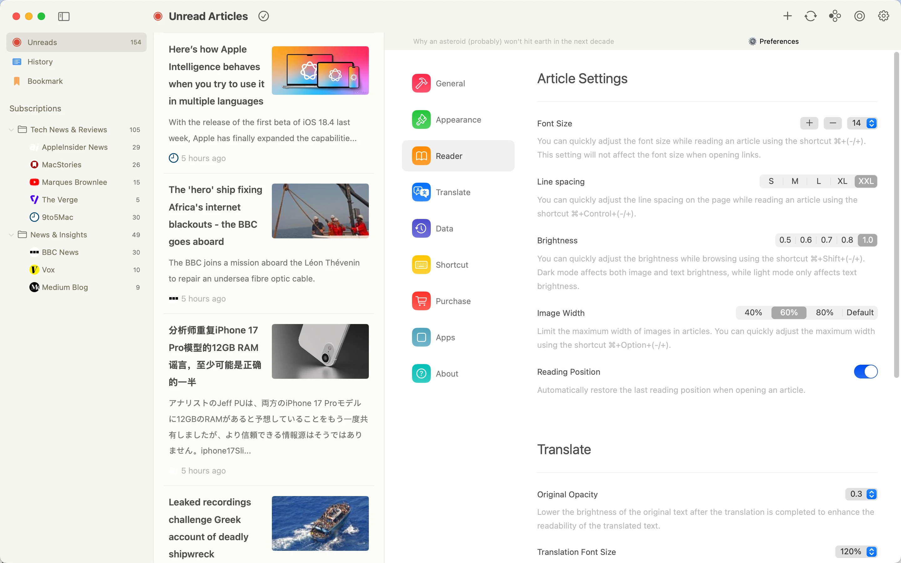
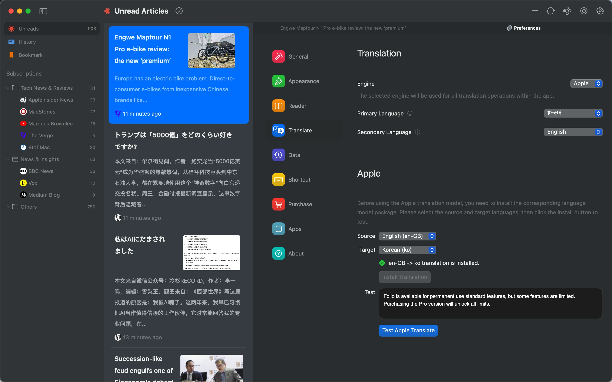
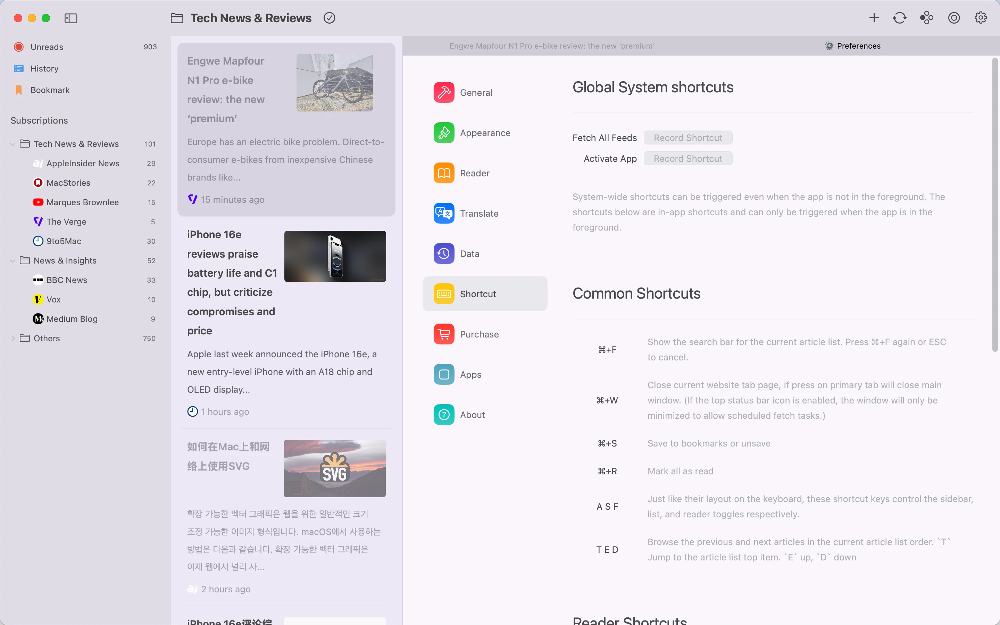

# README.md
- [Deutsch](README.de.md)
- [English](README.md)
- [Spanish](README.es.md)
- [French](README.fr.md)
- [Italian](README.it.md)
- [언어](README.ko.md)
- [日本語](README.ja.md)
- [简体中文](README.zh_cn.md)
- [繁体中文](README.zh_tw.md)

# Follo - RSS Übersetzungsleser

Laden Sie [die neueste Version aus dem macOS App Store](https://apps.apple.com/us/app/id6742404919) herunter

V1.0
---
### Funktionen:

#### Zweisprachiges Parallellesen
- Absatzvergleich: Original und Übersetzung werden abwechselnd wie in einem Gespräch nebeneinander angezeigt, um das Fremdsprachenlernen und den mehrsprachigen Informationszugang zu verbessern.
- Visueller Fokus: Hervorhebung des aktuell gelesenen Absatzes und automatische Ausrichtung von Original und Übersetzung für ein störungsfreies und ermüdungsfreies Leseerlebnis.

#### Personalisierbare Benutzeroberfläche
- 18 Themenfarben mit Hell- und Dunkelmodus, anpassbare Schriftarten, Titelbild-Verhältnis, Zeilenabstand und Helligkeit.
- Anpassbare Symbolleisten-Anordnung, Neuordnung von Funktionen und personalisierbare Feed-Symbole.

#### Flexible Informationsverwaltung
- Organisieren Sie Feed-Kategorien per Drag & Drop und erstellen Sie eine übersichtliche Abonnementstruktur.
- Zusammenführen ähnlicher Inhaltsquellen zu einheitlichen Feeds zur Reduzierung von Doppelabonnements.
- Mehrstufige Prioritätseinstellungen weisen Feeds unterschiedliche Gewichtungen zu und lösen Benachrichtigungen für hochprioritäre Inhalte aus.

#### Reibungslose & effiziente Interaktion
- Volle Tastaturkürzel-Unterstützung für Stilanpassungen, Artikel-Wischen und nahtlose Navigation.
- Trackpad-Gesten für schnelles Seitenblättern und intuitives Browsen.

#### Markdown-Integration
- Artikel mit einem Klick im Markdown-Format kopieren.
- Nahtlose Integration mit Obsidian, Notion und anderen Tools für müheloses Wissensmanagement.

### Warum Follo wählen?
- Rein & Fokussiert: Eine ablenkungsfreie Oberfläche für ein immersives Leseerlebnis.
- Tiefgehende Anpassung: Volle Kontrolle über visuellen Stil und Inhaltspriorität für einen maßgeschneiderten Lesefluss.
- Effizienter Workflow: Automatische Übersetzung, intelligente Benachrichtigungen und Tool-Integration schaffen einen nahtlosen Informationsverarbeitungskreislauf.

## Funktionsvorschau

## Video-Demo

