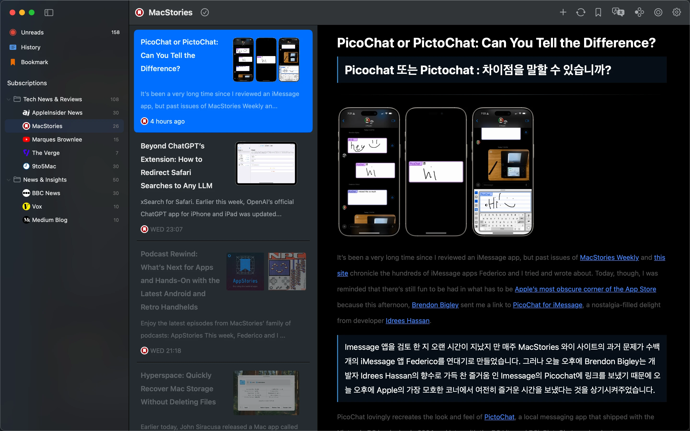

# README.md
- [Deutsch](README.de.md)
- [English](README.md)
- [Spanish](README.es.md)
- [French](README.fr.md)
- [Italian](README.it.md)
- [언어](README.ko.md)
- [日本語](README.ja.md)
- [简体中文](README.zh_cn.md)
- [繁体中文](README.zh_tw.md)

# Follo - Lector RSS con Traducción

Descarga [la última versión desde la Mac App Store](https://apps.apple.com/us/app/id6742404919)

V1.0
---
### Características:

#### Lectura Bilingüe en Paralelo
- Comparación por párrafos: El texto original y la traducción se disponen alternativamente uno al lado del otro como una conversación, mejorando el aprendizaje de idiomas y el acceso a información multilingüe.
- Enfoque visual: Resalta el párrafo que se está leyendo y alinea automáticamente el texto original y la traducción para una experiencia de lectura fluida sin distracciones ni fatiga.

#### Interfaz Personalizable
- 18 colores de tema con modos claro y oscuro, fuentes ajustables, proporción de portada, espaciado entre líneas y brillo.
- Diseño personalizable de la barra de herramientas, reordenación de funciones y personalización de iconos de feeds.

#### Gestión Flexible de la Información
- Organiza las categorías de feeds mediante arrastrar y soltar y construye una estructura clara de suscripción.
- Fusiona fuentes de contenido similares en feeds unificados para reducir suscripciones duplicadas.
- La configuración de prioridad multinivel asigna diferentes pesos a los feeds, activando notificaciones para contenido de alta prioridad.

#### Interacción Fluida y Eficiente
- Soporte completo de atajos de teclado para ajustar estilos, deslizar artículos y navegación sin interrupciones.
- Gestos del trackpad para hojeado rápido de páginas y navegación intuitiva.

#### Integración con Markdown
- Copia artículos en formato Markdown con un clic.
- Se integra perfectamente con Obsidian, Notion y otras herramientas para una gestión del conocimiento sin esfuerzo.

### ¿Por Qué Elegir Follo?
- Puro y Enfocado: Una interfaz sin distracciones diseñada para una experiencia de lectura inmersiva.
- Personalización Profunda: Control total sobre el estilo visual y la prioridad del contenido para un flujo de lectura personalizado.
- Flujo de Trabajo Eficiente: La traducción automática, las notificaciones inteligentes y la integración de herramientas crean un ciclo de procesamiento de información sin interrupciones.

## Vista Previa de Características

## Demostración en Video

