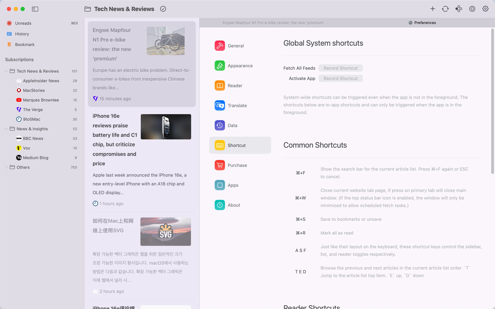

# README.md
- [Deutsch](README.de.md)
- [English](README.md)
- [Spanish](README.es.md)
- [French](README.fr.md)
- [Italian](README.it.md)
- [언어](README.ko.md)
- [日本語](README.ja.md)
- [简体中文](README.zh_cn.md)
- [繁体中文](README.zh_tw.md)

# Follo - Lecteur RSS avec Traduction

Téléchargez [la dernière version sur le Mac App Store](https://apps.apple.com/us/app/id6742404919)

V1.0
---
### Fonctionnalités :

#### Lecture Bilingue en Parallèle
- Comparaison par paragraphe : Le texte original et la traduction sont disposés alternativement côte à côte comme une conversation, améliorant l'apprentissage des langues étrangères et l'accès aux informations multilingues.
- Focus visuel : Met en évidence le paragraphe en cours de lecture et aligne automatiquement le texte original et la traduction pour une expérience de lecture fluide sans distraction ni fatigue.

#### Interface Personnalisable
- 18 couleurs de thème avec modes clair et sombre, polices ajustables, ratio de couverture, espacement des lignes et luminosité.
- Disposition personnalisable de la barre d'outils, réorganisation des fonctions et personnalisation des icônes de flux.

#### Gestion Flexible de l'Information
- Organisez les catégories de flux par glisser-déposer et construisez une structure d'abonnement claire.
- Fusionnez des sources de contenu similaires en flux unifiés pour réduire les abonnements en double.
- Les paramètres de priorité multi-niveaux attribuent différents poids aux flux, déclenchant des notifications pour le contenu hautement prioritaire.

#### Interaction Fluide et Efficace
- Prise en charge complète des raccourcis clavier pour l'ajustement des styles, le balayage des articles et la navigation transparente.
- Gestes du trackpad pour un feuilletage rapide des pages et une navigation intuitive.

#### Intégration Markdown
- Copiez des articles au format Markdown en un clic.
- S'intègre parfaitement avec Obsidian, Notion et d'autres outils pour une gestion sans effort des connaissances.

### Pourquoi Choisir Follo ?
- Pure & Concentrée : Une interface sans distraction conçue pour une expérience de lecture immersive.
- Personnalisation Approfondie : Contrôle total sur le style visuel et la priorité du contenu pour un flux de lecture personnalisé.
- Flux de Travail Efficace : La traduction automatique, les notifications intelligentes et l'intégration d'outils créent une boucle de traitement de l'information transparente.

## Aperçu des Fonctionnalités

## Démo Vidéo

