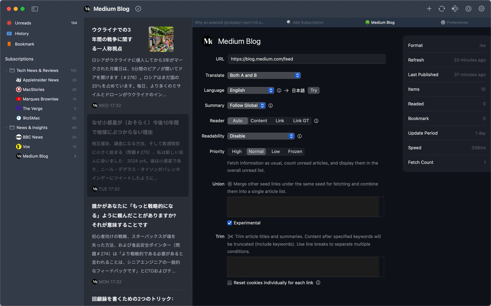
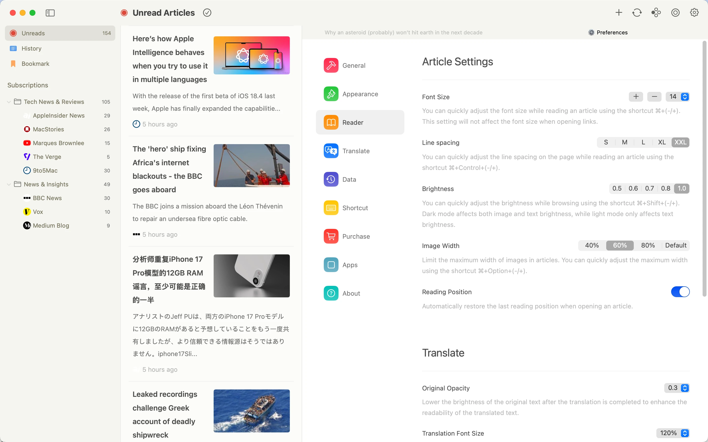

# README.md
- [Deutsch](README.de.md)
- [English](README.md)
- [Spanish](README.es.md)
- [French](README.fr.md)
- [Italian](README.it.md)
- [언어](README.ko.md)
- [日本語](README.ja.md)
- [简体中文](README.zh_cn.md)
- [繁体中文](README.zh_tw.md)

# Follo - Lettore RSS con Traduzione

Scarica [l'ultima versione dal Mac App Store](https://apps.apple.com/us/app/id6742404919)

V1.0
---
### Caratteristiche:

#### Lettura Bilingue Parallela
- Confronto per paragrafi: Il testo originale e la traduzione sono disposti alternativamente fianco a fianco come una conversazione, migliorando l'apprendimento delle lingue straniere e l'accesso alle informazioni multilingue.
- Focus visivo: Evidenzia il paragrafo attualmente in lettura e allinea automaticamente il testo originale e la traduzione per un'esperienza di lettura fluida senza distrazioni né affaticamento.

#### Interfaccia Personalizzabile
- 18 colori tema con modalità chiara e scura, caratteri regolabili, rapporto di copertina, spaziatura delle righe e luminosità.
- Layout personalizzabile della barra degli strumenti, riordino delle funzioni e personalizzazione delle icone dei feed.

#### Gestione Flessibile delle Informazioni
- Organizza le categorie dei feed tramite drag & drop e costruisci una chiara struttura di abbonamento.
- Unisci fonti di contenuto simili in feed unificati per ridurre gli abbonamenti duplicati.
- Le impostazioni di priorità multilivello assegnano diversi pesi ai feed, attivando notifiche per i contenuti ad alta priorità.

#### Interazione Fluida ed Efficiente
- Supporto completo delle scorciatoie da tastiera per la regolazione degli stili, lo scorrimento degli articoli e la navigazione senza interruzioni.
- Gesti del trackpad per lo sfoglio rapido delle pagine e la navigazione intuitiva.

#### Integrazione Markdown
- Copia articoli in formato Markdown con un clic.
- Si integra perfettamente con Obsidian, Notion e altri strumenti per una gestione senza sforzo della conoscenza.

### Perché Scegliere Follo?
- Puro & Concentrato: Un'interfaccia senza distrazioni progettata per un'esperienza di lettura immersiva.
- Personalizzazione Profonda: Controllo totale sullo stile visivo e sulla priorità dei contenuti per un flusso di lettura personalizzato.
- Flusso di Lavoro Efficiente: La traduzione automatica, le notifiche intelligenti e l'integrazione degli strumenti creano un ciclo di elaborazione delle informazioni senza interruzioni.

## Anteprima delle Funzionalità

## Video Dimostrativi

