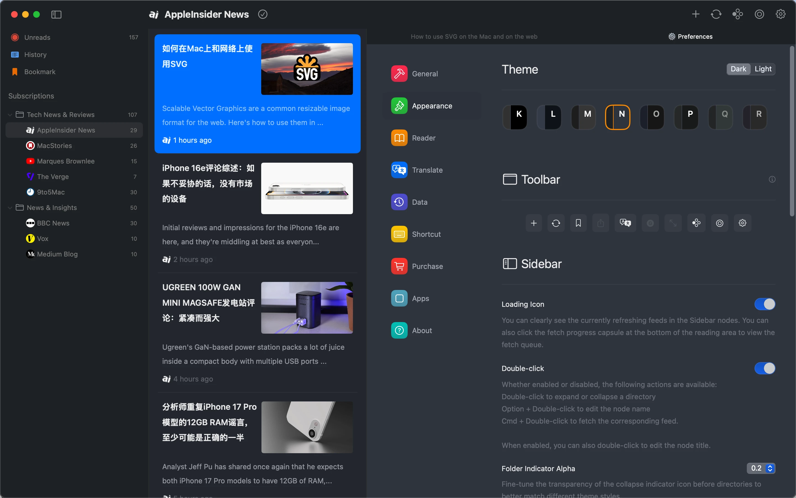
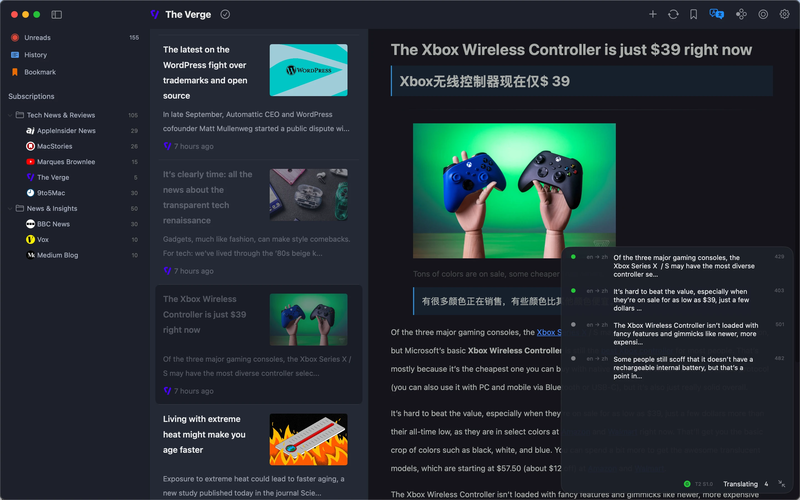
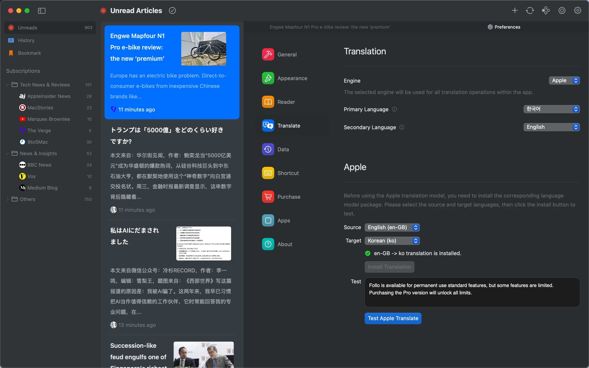

# README.md
- [Deutsch](README.de.md)
- [English](README.md)
- [Spanish](README.es.md)
- [French](README.fr.md)
- [Italian](README.it.md)
- [언어](README.ko.md)
- [日本語](README.ja.md)
- [简体中文](README.zh_cn.md)
- [繁体中文](README.zh_tw.md)

# Follo - RSS 翻訳リーダー

macOS App Store から[最新版をダウンロード](https://apps.apple.com/us/app/id6742404919)

V1.0
---
### 機能：

#### バイリンガル並列読書
- 段落比較：原文と訳文が会話のように交互に並び、外国語学習と多言語情報アクセスを向上させます。
- ビジュアルフォーカス：現在読んでいる段落をハイライト表示し、原文と訳文を自動的に整列させることで、ストレスのない快適な読書体験を提供します。

#### カスタマイズ可能なインターフェース
- 18種類のテーマカラー、ライト/ダークモード対応、フォント、カバー比率、行間、明るさの調整が可能。
- ツールバーレイアウトのカスタマイズ、機能の並び替え、フィードアイコンのパーソナライズが可能。

#### 柔軟な情報管理
- ドラッグ＆ドロップでフィードカテゴリを整理し、明確な購読構造を構築。
- 類似コンテンツソースを統合フィードにマージし、重複購読を削減。
- マルチレベルの優先度設定でフィードに重み付けを行い、高優先度コンテンツの通知と未読アイテムの優先処理を実現。

#### スムーズで効率的な操作
- スタイル調整、記事のスワイプ、シームレスなナビゲーションに対応したフルキーボードショートカット。
- トラックパッドジェスチャーによる直感的なページめくりとブラウジング。

#### Markdown 統合
- ワンクリックで記事を Markdown 形式でコピー。
- Obsidian、Notion などのツールとシームレスに統合し、知識管理を効率化。

### なぜ Follo を選ぶのか？
- 純粋＆集中：没入型の読書体験のための、邪魔のないインターフェース設計。
- 深いカスタマイズ：視覚スタイルとコンテンツの優先順位を完全にコントロールし、個別化された読書フローを実現。
- 効率的なワークフロー：自動翻訳、スマート通知、ツール統合により、シームレスな情報処理ループを作成。

## 機能プレビュー

## デモ動画

