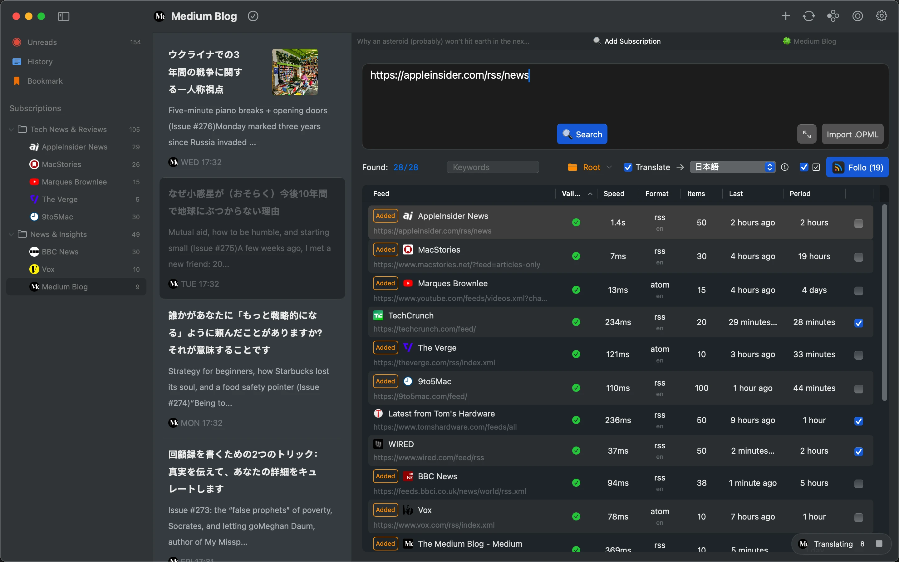

# README.md
- [Deutsch](README.de.md)
- [English](README.md)
- [Spanish](README.es.md)
- [French](README.fr.md)
- [Italian](README.it.md)
- [언어](README.ko.md)
- [日本語](README.ja.md)
- [简体中文](README.zh_cn.md)
- [繁体中文](README.zh_tw.md)

# Follo - RSS Translation Reader

Download [the latest release from macOS appstore](https://apps.apple.com/us/app/id6742404919)

V1.0
---
### Features:

#### Bilingual Parallel Reading
- Paragraph-by-paragraph comparison: Original text and translation are alternately arranged, displayed side by side like a conversation, enhancing foreign language learning and cross-language information access.
- Visual focus: Highlights the current reading paragraph, automatically aligning original and translated text for a seamless reading experience without distraction or fatigue.

#### Personalized Interface Customization
- 18 theme colors with light and dark modes, adjustable fonts, cover ratio, line spacing, and brightness.
- Customizable toolbar layout, reorder functions, and personalize feed icons to suit your preferences.

#### Flexible Information Management
- Drag and drop to organize feed categories and build a clear subscription structure.
- Merge similar content sources into unified feeds to reduce duplicate subscriptions.
- Multi-level priority settings assign different weights to feeds, triggering notifications for high-priority content and prioritizing unread items.

#### Smooth & Efficient Interaction
- Full keyboard shortcut support for adjusting styles, swiping between articles, and seamless navigation.
- Trackpad gestures for quick page flipping and intuitive browsing.

#### Markdown Integration
- One-click copy articles in Markdown format.
- Seamlessly integrates with Obsidian, Notion, and other tools for effortless knowledge management.

### Why Choose Follo?
- Pure & Focused: A distraction-free interface designed for an immersive reading experience.
- Deep Customization: Full control over visual style and content priority for a tailored reading flow.
- Efficient Workflow: Auto-translation, smart notifications, and tool integrations create a seamless information-processing loop.

## Features

## Video Demo

