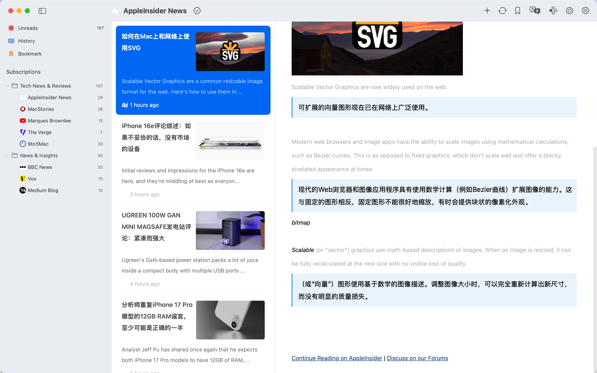

# README.md
- [Deutsch](README.de.md)
- [English](README.md)
- [Spanish](README.es.md)
- [French](README.fr.md)
- [Italian](README.it.md)
- [언어](README.ko.md)
- [日本語](README.ja.md)
- [简体中文](README.zh_cn.md)
- [繁体中文](README.zh_tw.md)

# Follo - RSS 翻译阅读器

从 macOS 应用商店下载[最新版本](https://apps.apple.com/us/app/id6742404919)

V1.0
---
### 功能特点：

#### 双语平行阅读
- 段落对比：原文与译文交替排列，像对话一样并排显示，提升外语学习效果和跨语言信息获取体验。
- 视觉焦点：突出显示当前阅读段落，自动对齐原文和译文，带来无干扰、不疲劳的流畅阅读体验。

#### 个性化界面定制
- 18种主题颜色，支持明暗模式，可调节字体、封面比例、行间距和亮度。
- 可自定义工具栏布局，重新排序功能，个性化订阅源图标以满足个人偏好。

#### 灵活的信息管理
- 通过拖放组织订阅分类，构建清晰的订阅结构。
- 合并相似内容源为统一订阅，减少重复订阅。
- 多级优先级设置为订阅源分配不同权重，触发高优先级内容通知，优先处理未读项。

#### 流畅高效的交互
- 全键盘快捷键支持，用于调整样式、滑动文章和无缝导航。
- 触控板手势支持快速翻页和直观浏览。

#### Markdown 集成
- 一键复制 Markdown 格式文章。
- 与 Obsidian、Notion 等工具无缝集成，轻松进行知识管理。

### 为什么选择 Follo？
- 纯粹专注：无干扰界面设计，打造沉浸式阅读体验。
- 深度定制：完全掌控视觉风格和内容优先级，打造个性化阅读流程。
- 高效工作流：自动翻译、智能通知和工具集成，创建无缝的信息处理闭环。

## 功能预览

## 视频演示

